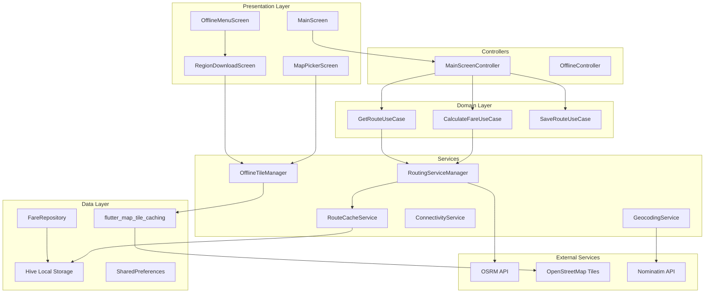
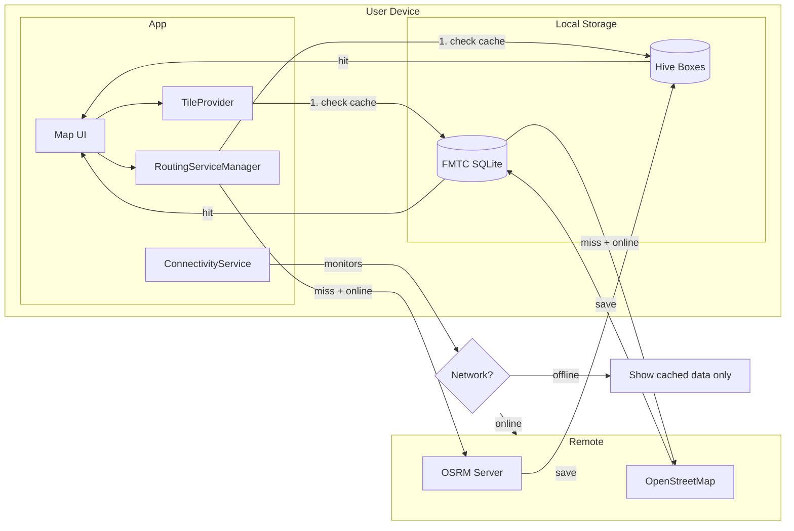
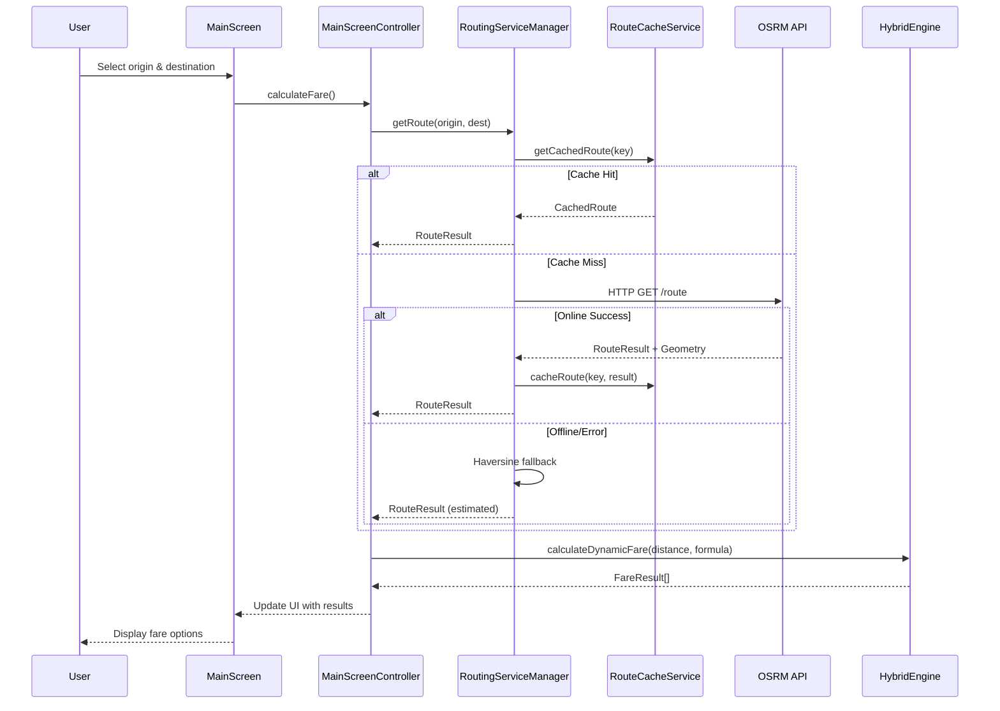
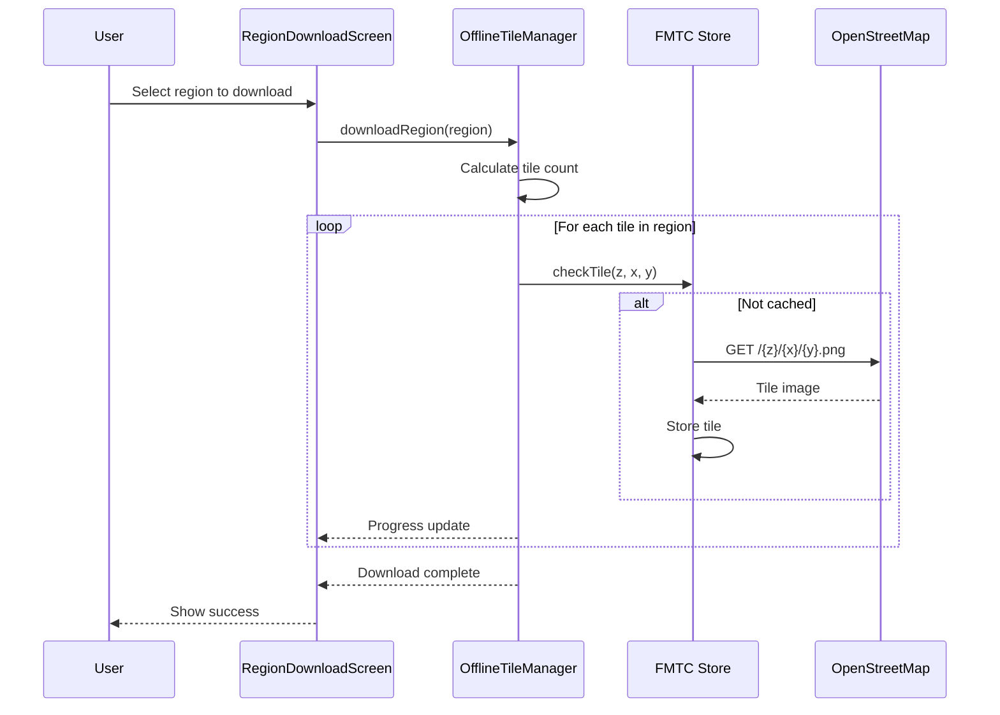

# PH Fare Calculator - Architecture Plan

**Version:** 1.0.0  
**Date:** 2025-12-10  
**Status:** Draft - Pending Implementation  
**Author:** Architect Mode

---

## Executive Summary

This architecture plan provides a comprehensive technical specification for implementing three major features in the PH Fare Calculator Flutter application:

1. **Road-Following Routing with Fare Calculation** - Display actual road routes on maps instead of straight lines, with fare calculation based on real road distances
2. **Offline-First Architecture with Downloadable Maps** - Enable users to download specific regions for offline use, including map tiles and cached route data
3. **Codebase Organization** - Refactor the monolithic MainScreen (1600+ lines), improve folder structure, and establish clear architectural patterns

The implementation is organized into 5 phases spanning approximately 8-12 weeks, with careful attention to risk mitigation and backward compatibility.

---

## Table of Contents

1. [Current State Analysis](#1-current-state-analysis)
2. [Feature 1: Road-Following Routing](#2-feature-1-road-following-routing)
3. [Feature 2: Offline-First Architecture](#3-feature-2-offline-first-architecture)
4. [Feature 3: Codebase Organization](#4-feature-3-codebase-organization)
5. [System Architecture Diagrams](#5-system-architecture-diagrams)
6. [Data Flow Diagrams](#6-data-flow-diagrams)
7. [New Files and Classes](#7-new-files-and-classes)
8. [Dependencies](#8-dependencies)
9. [Implementation Phases](#9-implementation-phases)
10. [Risk Assessment](#10-risk-assessment)
11. [Testing Strategy](#11-testing-strategy)
12. [Architecture Decisions](#12-architecture-decisions)

---

## 1. Current State Analysis

Based on analysis of [`docs/CODEBASE_ANALYSIS.md`](docs/CODEBASE_ANALYSIS.md) and direct code inspection:

### 1.1 Architecture Overview
```
┌─────────────────────────────────────────────────────────────┐
│                    Presentation Layer                        │
│  ┌─────────────────────────────────────────────────────────┐│
│  │ MainScreen.dart (1669 lines - GOD CLASS - needs refactor)││
│  │ MapPickerScreen, OfflineMenuScreen, SettingsScreen      ││
│  └─────────────────────────────────────────────────────────┘│
├─────────────────────────────────────────────────────────────┤
│                    Domain/Core Layer                         │
│  ┌─────────────────────────────────────────────────────────┐│
│  │ HybridEngine (fare calculation - STATIC + DYNAMIC)      ││
│  │ Models: FareFormula, FareResult, Location, RouteResult  ││
│  └─────────────────────────────────────────────────────────┘│
├─────────────────────────────────────────────────────────────┤
│                    Data/Service Layer                        │
│  ┌─────────────────────────────────────────────────────────┐│
│  │ RoutingService (OSRM demo - NOT PRODUCTION READY)       ││
│  │ GeocodingService (Nominatim - ONLINE ONLY)              ││
│  │ SettingsService, FareRepository                          ││
│  └─────────────────────────────────────────────────────────┘│
└─────────────────────────────────────────────────────────────┘
```

### 1.2 Critical Gaps Identified

| Gap | Current State | Required State |
|-----|--------------|----------------|
| Routing Server | OSRM demo server (rate-limited, no SLA) | Reliable routing with fallback |
| Route Geometry | Available via OSRM but falls back to empty list | Always display route on map |
| Offline Tiles | None - requires internet | Downloadable region tiles |
| Offline Routing | None | Cache calculated routes |
| MainScreen | 1669-line god class | Modular widgets + state management |
| Code Organization | Functional but inconsistent | Clean architecture patterns |

### 1.3 Current Dependencies (from [`pubspec.yaml`](pubspec.yaml))
- `flutter_map: ^8.2.2` - Map rendering (no offline support)
- `latlong2: ^0.9.1` - Geospatial calculations
- `http: ^1.6.0` - API calls
- `hive: ^2.2.3` + `hive_flutter: ^1.1.0` - Local database
- `geolocator: ^13.0.2` - GPS location
- `injectable: ^2.3.0` + `get_it: ^7.6.0` - Dependency injection

---

## 2. Feature 1: Road-Following Routing

### 2.1 Requirements
- Display actual road routes on the map (polylines following roads)
- Calculate fare based on actual road distance (not straight-line)
- Provide fallback strategy when routing service is unavailable
- Show route duration estimates when available

### 2.2 Technical Design

#### 2.2.1 Routing Service Architecture
```
┌─────────────────────────────────────────────────────────────┐
│                    RoutingServiceManager                     │
│  (Orchestrates multiple providers with failover)             │
├─────────────────────────────────────────────────────────────┤
│  ┌──────────────┐  ┌──────────────┐  ┌──────────────────┐  │
│  │ Primary:     │  │ Secondary:   │  │ Fallback:        │  │
│  │ OSRM Public  │→ │ Cached Route │→ │ Haversine +      │  │
│  │ or Self-Host │  │ (if exists)  │  │ Estimated Route  │  │
│  └──────────────┘  └──────────────┘  └──────────────────┘  │
└─────────────────────────────────────────────────────────────┘
```

#### 2.2.2 Route Caching Strategy
```dart
/// Cached route stored in Hive
class CachedRoute {
  final String routeKey; // hash of origin+destination
  final double distance; // meters
  final double? duration; // seconds
  final List<LatLng> geometry;
  final DateTime cachedAt;
  final DateTime expiresAt;
}
```

#### 2.2.3 Fallback Strategy
1. **Primary**: OSRM public server (`router.project-osrm.org`) or self-hosted
2. **Cache Check**: Look for previously calculated route in Hive
3. **Fallback**: Haversine distance + approximate geometry (straight line with waypoints)

#### 2.2.4 Enhanced Route Visualization
- Use [`PolylineLayer`](lib/src/presentation/widgets/map_selection_widget.dart:236) (already implemented)
- Add route animation for better UX
- Show intermediate waypoints for long routes
- Display distance/duration badge on route

### 2.3 New/Modified Files

| File | Action | Description |
|------|--------|-------------|
| `lib/src/services/routing/routing_service_manager.dart` | CREATE | Orchestrates routing with failover |
| `lib/src/services/routing/route_cache_service.dart` | CREATE | Caches calculated routes in Hive |
| `lib/src/models/cached_route.dart` | CREATE | Model for cached route data |
| `lib/src/services/routing/osrm_routing_service.dart` | MODIFY | Add configurable endpoint, timeout handling |
| `lib/src/core/hybrid_engine.dart` | MODIFY | Use RoutingServiceManager |

---

## 3. Feature 2: Offline-First Architecture

### 3.1 Requirements
- Download map tiles for specific regions (e.g., "Metro Manila", "Cebu")
- Display download progress and manage storage
- Graceful degradation when offline
- Cache routes for offline viewing
- Connectivity detection

### 3.2 Technical Design

#### 3.2.1 Offline Tile Architecture
```
┌─────────────────────────────────────────────────────────────┐
│                    OfflineTileProvider                       │
│  (flutter_map_tile_caching integration)                      │
├─────────────────────────────────────────────────────────────┤
│  ┌──────────────┐                                           │
│  │ Check Local  │ → Found? → Serve from disk                │
│  │ SQLite Cache │                                           │
│  └──────────────┘                                           │
│         │ Not found                                          │
│         ▼                                                    │
│  ┌──────────────┐                                           │
│  │ Fetch Online │ → Save to cache → Serve                   │
│  │ (if network) │                                           │
│  └──────────────┘                                           │
│         │ No network                                         │
│         ▼                                                    │
│  ┌──────────────┐                                           │
│  │ Show Offline │ → Gray placeholder tile                   │
│  │ Placeholder  │                                           │
│  └──────────────┘                                           │
└─────────────────────────────────────────────────────────────┘
```

#### 3.2.2 Region Definition
```dart
/// Predefined downloadable regions
class DownloadableRegion {
  final String id;
  final String name;
  final String description;
  final LatLngBounds bounds;
  final int minZoom;
  final int maxZoom;
  final int estimatedTileCount;
  final int estimatedSizeMB;
}

/// Predefined regions for Philippines
static final regions = [
  DownloadableRegion(
    id: 'metro_manila',
    name: 'Metro Manila',
    bounds: LatLngBounds(LatLng(14.35, 120.90), LatLng(14.80, 121.15)),
    minZoom: 10,
    maxZoom: 16,
    estimatedTileCount: 15000,
    estimatedSizeMB: 150,
  ),
  DownloadableRegion(
    id: 'cebu',
    name: 'Cebu City & Metro',
    bounds: LatLngBounds(LatLng(10.20, 123.80), LatLng(10.45, 124.00)),
    minZoom: 10,
    maxZoom: 16,
    estimatedTileCount: 8000,
    estimatedSizeMB: 80,
  ),
  // Additional regions...
];
```

#### 3.2.3 Storage Management
```dart
/// Storage management for offline data
class OfflineStorageManager {
  /// Maximum storage limit (configurable, default 500MB)
  static const int defaultMaxStorageMB = 500;
  
  /// Check available storage
  Future<StorageStatus> getStorageStatus();
  
  /// Delete region's cached tiles
  Future<void> deleteRegion(String regionId);
  
  /// Clear all offline data
  Future<void> clearAllOfflineData();
  
  /// Get per-region storage usage
  Future<Map<String, int>> getRegionSizes();
}
```

#### 3.2.4 Connectivity Detection
```dart
/// Connectivity service using connectivity_plus
class ConnectivityService {
  /// Stream of connectivity changes
  Stream<ConnectivityStatus> get connectivityStream;
  
  /// Current connectivity status
  Future<ConnectivityStatus> get currentStatus;
  
  /// Check if specific service is reachable
  Future<bool> isServiceReachable(String url);
}

enum ConnectivityStatus {
  online,
  offline,
  limited, // Has connection but services unreachable
}
```

#### 3.2.5 User Flow for Downloading Maps

```
┌─────────────────────────────────────────────────────────────┐
│  OfflineMenuScreen                                           │
│  ┌─────────────────────────────────────────────────────────┐│
│  │ [📱 Saved Routes]                                       ││
│  │ [📊 Fare Reference]                                     ││
│  │ [📥 Download Maps] ← NEW                                ││
│  └─────────────────────────────────────────────────────────┘│
└─────────────────────────────────────────────────────────────┘
                           │
                           ▼
┌─────────────────────────────────────────────────────────────┐
│  RegionDownloadScreen (NEW)                                  │
│  ┌─────────────────────────────────────────────────────────┐│
│  │ Available Regions:                                       ││
│  │ ┌─────────────────────────────────────────────────────┐ ││
│  │ │ 🗺️ Metro Manila         [DOWNLOAD] or [✓ Downloaded]│ ││
│  │ │    ~150 MB, Zoom 10-16                              │ ││
│  │ └─────────────────────────────────────────────────────┘ ││
│  │ ┌─────────────────────────────────────────────────────┐ ││
│  │ │ 🗺️ Cebu Metro           [DOWNLOAD]                  │ ││
│  │ │    ~80 MB, Zoom 10-16                               │ ││
│  │ └─────────────────────────────────────────────────────┘ ││
│  │                                                          ││
│  │ Storage: 150/500 MB used                                 ││
│  │ [Manage Storage]                                         ││
│  └─────────────────────────────────────────────────────────┘│
└─────────────────────────────────────────────────────────────┘
```

### 3.3 Offline Routing Strategy

**Important Decision**: True offline routing (calculating new routes without internet) requires a graph engine like Valhalla/GraphHopper running on device, which is extremely complex and heavy (100MB+ data files, C++ bindings).

**Chosen Approach**: **Cache-based offline route viewing**
- Cache all calculated routes when online
- When offline, show previously calculated routes only
- Display clear message when attempting new offline route
- Haversine fallback with estimated fare (clearly marked as estimate)

### 3.4 New/Modified Files

| File | Action | Description |
|------|--------|-------------|
| `lib/src/services/offline/offline_tile_manager.dart` | CREATE | Manages tile downloads using FMTC |
| `lib/src/services/offline/region_download_service.dart` | CREATE | Downloads specific regions |
| `lib/src/services/offline/offline_storage_manager.dart` | CREATE | Storage quota and cleanup |
| `lib/src/services/connectivity_service.dart` | CREATE | Network state detection |
| `lib/src/models/downloadable_region.dart` | CREATE | Region definitions |
| `lib/src/models/download_progress.dart` | CREATE | Download state tracking |
| `lib/src/presentation/screens/region_download_screen.dart` | CREATE | UI for downloading regions |
| `lib/src/presentation/widgets/offline_indicator.dart` | CREATE | Shows offline status banner |
| `lib/src/presentation/screens/offline_menu_screen.dart` | MODIFY | Add "Download Maps" option |
| `lib/src/presentation/screens/map_picker_screen.dart` | MODIFY | Use offline-aware tile provider |
| `lib/src/presentation/widgets/map_selection_widget.dart` | MODIFY | Use offline-aware tile provider |
| `assets/data/regions.json` | CREATE | Predefined region configurations |

---

## 4. Feature 3: Codebase Organization

### 4.1 MainScreen Refactoring Strategy

The current [`MainScreen`](lib/src/presentation/screens/main_screen.dart) (1669 lines) violates Single Responsibility Principle. It will be decomposed into:

#### 4.1.1 Extracted Widgets

| Widget | Lines (approx) | Responsibility |
|--------|---------------|----------------|
| `LocationInputCard` | 150 | Origin/destination input with geocoding |
| `PassengerSelector` | 200 | Passenger count and discount selection |
| `TravelOptionsBar` | 80 | Sorting and filter chips |
| `RouteMapPreview` | 100 | Map display with route |
| `FareResultsList` | 150 | Grouped fare results display |
| `TransportModeHeader` | 50 | Section headers for transport modes |
| `CalculateFareButton` | 50 | Primary action button |
| `PassengerBottomSheet` | 150 | Passenger details modal |
| `FirstTimePassengerPrompt` | 100 | Onboarding prompt widget |

#### 4.1.2 State Management Extraction

```dart
/// MainScreen state container (ChangeNotifier or Cubit)
class MainScreenController extends ChangeNotifier {
  // Location state
  Location? originLocation;
  Location? destinationLocation;
  LatLng? originLatLng;
  LatLng? destinationLatLng;
  
  // Passenger state
  int regularPassengers = 1;
  int discountedPassengers = 0;
  
  // Route state
  List<LatLng> routePoints = [];
  bool isCalculating = false;
  
  // Results state
  List<FareResult> fareResults = [];
  SortCriteria sortCriteria = SortCriteria.priceAsc;
  String? errorMessage;
  
  // Methods
  Future<void> setOrigin(Location location);
  Future<void> setDestination(Location location);
  Future<void> swapLocations();
  Future<void> calculateFare();
  Future<void> saveRoute();
  void updatePassengers(int regular, int discounted);
  void setSortCriteria(SortCriteria criteria);
}
```

### 4.2 Folder Structure Improvements

#### 4.2.1 Current Structure
```
lib/src/
├── core/
│   ├── di/
│   ├── errors/
│   ├── theme/
│   └── hybrid_engine.dart
├── models/
├── presentation/
│   ├── screens/
│   └── widgets/
├── repositories/
└── services/
```

#### 4.2.2 Proposed Structure
```
lib/src/
├── core/
│   ├── constants/
│   │   └── region_constants.dart
│   ├── di/
│   │   ├── injection.dart
│   │   └── injection.config.dart
│   ├── errors/
│   │   └── failures.dart
│   ├── theme/
│   │   └── app_theme.dart
│   └── utils/
│       ├── extensions.dart          # NEW: String, List extensions
│       └── formatters.dart          # NEW: Currency, distance formatters
├── domain/
│   ├── entities/                    # NEW: Pure domain entities
│   │   ├── fare.dart
│   │   └── route.dart
│   ├── repositories/                # MOVED: Repository interfaces
│   │   └── fare_repository.dart
│   └── usecases/                    # NEW: Business use cases
│       ├── calculate_fare_usecase.dart
│       ├── get_route_usecase.dart
│       └── save_route_usecase.dart
├── data/
│   ├── datasources/                 # NEW: Data source abstractions
│   │   ├── local/
│   │   │   ├── hive_datasource.dart
│   │   │   └── shared_prefs_datasource.dart
│   │   └── remote/
│   │       ├── osrm_datasource.dart
│   │       └── nominatim_datasource.dart
│   ├── models/                      # MOVED: Data transfer objects
│   │   ├── fare_formula.dart
│   │   ├── fare_result.dart
│   │   └── ...
│   └── repositories/                # NEW: Repository implementations
│       └── fare_repository_impl.dart
├── presentation/
│   ├── controllers/                 # NEW: Screen controllers
│   │   ├── main_screen_controller.dart
│   │   └── settings_controller.dart
│   ├── screens/
│   │   ├── main/                    # NEW: Feature folders
│   │   │   ├── main_screen.dart     # REFACTORED
│   │   │   └── widgets/             # Screen-specific widgets
│   │   │       ├── location_input_card.dart
│   │   │       ├── passenger_selector.dart
│   │   │       ├── travel_options_bar.dart
│   │   │       ├── route_map_preview.dart
│   │   │       └── fare_results_list.dart
│   │   ├── offline/
│   │   │   ├── offline_menu_screen.dart
│   │   │   ├── region_download_screen.dart  # NEW
│   │   │   └── saved_routes_screen.dart
│   │   ├── map/
│   │   │   └── map_picker_screen.dart
│   │   └── settings/
│   │       └── settings_screen.dart
│   └── widgets/                     # Shared widgets
│       ├── common/
│       │   ├── loading_indicator.dart
│       │   └── error_card.dart
│       ├── map/
│       │   ├── map_selection_widget.dart
│       │   └── offline_indicator.dart  # NEW
│       └── fare/
│           └── fare_result_card.dart
└── services/
    ├── fare/
    │   ├── fare_calculation_service.dart  # Extracted from HybridEngine
    │   └── fare_comparison_service.dart
    ├── geocoding/
    │   └── geocoding_service.dart
    ├── routing/
    │   ├── routing_service.dart
    │   ├── osrm_routing_service.dart
    │   ├── haversine_routing_service.dart
    │   ├── routing_service_manager.dart    # NEW
    │   └── route_cache_service.dart        # NEW
    ├── offline/                            # NEW
    │   ├── offline_tile_manager.dart
    │   ├── region_download_service.dart
    │   └── offline_storage_manager.dart
    ├── connectivity_service.dart           # NEW
    └── settings_service.dart
```

### 4.3 .gitignore Additions

Add to [`.gitignore`](.gitignore):

```gitignore
# Additional patterns to add

# Generated code
*.g.dart
*.freezed.dart
*.mocks.dart
lib/src/l10n/app_localizations_*.dart
!lib/src/l10n/app_localizations.dart

# Test coverage
coverage/
*.lcov

# Build artifacts
*.apk
*.aab
*.ipa
*.app
*.dSYM/

# Offline map cache (large binary files)
offline_maps/
*.mbtiles

# Environment files
.env.*
!.env.example

# IDE
.idea/
*.iml
.vscode/settings.json
.vscode/launch.json

# macOS
.DS_Store
```

### 4.4 Code Organization Conventions

#### 4.4.1 File Naming
- Use `snake_case` for all file names
- Suffix screen files with `_screen.dart`
- Suffix widget files with `_widget.dart` (optional, for clarity)
- Suffix controller files with `_controller.dart`
- Suffix service files with `_service.dart`

#### 4.4.2 Import Organization
```dart
// 1. Dart SDK imports
import 'dart:async';
import 'dart:convert';

// 2. Flutter imports
import 'package:flutter/material.dart';

// 3. Third-party package imports
import 'package:get_it/get_it.dart';
import 'package:hive/hive.dart';

// 4. Project imports (relative)
import '../../core/di/injection.dart';
import '../../models/location.dart';
```

#### 4.4.3 Widget Composition
- Extract widgets when they exceed ~100 lines
- Use `const` constructors where possible
- Prefer composition over inheritance
- Keep build methods under 50 lines

---

## 5. System Architecture Diagrams

### 5.1 High-Level System Architecture



### 5.2 Offline Architecture



---

## 6. Data Flow Diagrams

### 6.1 Fare Calculation Flow



### 6.2 Offline Map Download Flow



---

## 7. New Files and Classes

### 7.1 Complete File List

#### Phase 1: Codebase Organization (Foundation)

| File Path | Type | Description | Effort | Risk |
|-----------|------|-------------|--------|------|
| `lib/src/core/utils/extensions.dart` | NEW | Common extension methods | XS | Low |
| `lib/src/core/utils/formatters.dart` | NEW | Currency/distance formatters | XS | Low |
| `lib/src/presentation/controllers/main_screen_controller.dart` | NEW | MainScreen state management | M | Medium |
| `lib/src/presentation/screens/main/widgets/location_input_card.dart` | NEW | Location input widget | S | Low |
| `lib/src/presentation/screens/main/widgets/passenger_selector.dart` | NEW | Passenger selection widget | S | Low |
| `lib/src/presentation/screens/main/widgets/travel_options_bar.dart` | NEW | Filter/sort options | XS | Low |
| `lib/src/presentation/screens/main/widgets/route_map_preview.dart` | NEW | Map preview widget | S | Low |
| `lib/src/presentation/screens/main/widgets/fare_results_list.dart` | NEW | Fare results display | S | Low |
| `lib/src/presentation/screens/main/main_screen.dart` | REFACTOR | Simplified MainScreen | M | Medium |

#### Phase 2: Routing Enhancement

| File Path | Type | Description | Effort | Risk |
|-----------|------|-------------|--------|------|
| `lib/src/services/routing/routing_service_manager.dart` | NEW | Multi-provider routing with failover | M | Medium |
| `lib/src/services/routing/route_cache_service.dart` | NEW | Route caching in Hive | S | Low |
| `lib/src/models/cached_route.dart` | NEW | Cached route model | XS | Low |
| `lib/src/models/cached_route.g.dart` | GENERATED | Hive adapter | XS | Low |
| `lib/src/services/routing/osrm_routing_service.dart` | MODIFY | Configurable endpoint, better error handling | S | Low |

#### Phase 3: Connectivity & Offline Infrastructure

| File Path | Type | Description | Effort | Risk |
|-----------|------|-------------|--------|------|
| `lib/src/services/connectivity_service.dart` | NEW | Network state monitoring | S | Low |
| `lib/src/presentation/widgets/common/offline_indicator.dart` | NEW | Offline status banner | XS | Low |

#### Phase 4: Offline Maps

| File Path | Type | Description | Effort | Risk |
|-----------|------|-------------|--------|------|
| `lib/src/services/offline/offline_tile_manager.dart` | NEW | FMTC wrapper for tile management | L | High |
| `lib/src/services/offline/region_download_service.dart` | NEW | Region download logic | M | Medium |
| `lib/src/services/offline/offline_storage_manager.dart` | NEW | Storage quota management | S | Low |
| `lib/src/models/downloadable_region.dart` | NEW | Region model | XS | Low |
| `lib/src/models/download_progress.dart` | NEW | Download state model | XS | Low |
| `lib/src/presentation/screens/offline/region_download_screen.dart` | NEW | Download UI screen | M | Medium |
| `lib/src/presentation/screens/offline_menu_screen.dart` | MODIFY | Add download maps option | S | Low |
| `lib/src/presentation/widgets/map/offline_tile_provider.dart` | NEW | Custom tile provider | M | High |
| `assets/data/regions.json` | NEW | Predefined regions config | XS | Low |

#### Phase 5: Integration & Polish

| File Path | Type | Description | Effort | Risk |
|-----------|------|-------------|--------|------|
| `lib/src/presentation/screens/map_picker_screen.dart` | MODIFY | Use offline tile provider | S | Low |
| `lib/src/presentation/widgets/map_selection_widget.dart` | MODIFY | Use offline tile provider | S | Low |
| `lib/src/core/di/injection.dart` | MODIFY | Register new services | S | Low |
| `.gitignore` | MODIFY | Add new patterns | XS | Low |

### 7.2 Key Class Specifications

```dart
// ====== lib/src/services/routing/routing_service_manager.dart ======

/// Manages routing with automatic failover between providers
@lazySingleton
class RoutingServiceManager implements RoutingService {
  final OsrmRoutingService _osrmService;
  final HaversineRoutingService _haversineService;
  final RouteCacheService _cacheService;
  final ConnectivityService _connectivityService;
  
  /// Attempts to get route with failover:
  /// 1. Check cache first
  /// 2. Try OSRM if online
  /// 3. Fall back to Haversine with estimated geometry
  @override
  Future<RouteResult> getRoute(
    double originLat,
    double originLng,
    double destLat,
    double destLng,
  );
  
  /// Same as getRoute but forces fresh fetch (bypasses cache)
  Future<RouteResult> getRouteFresh(...);
}
```

```dart
// ====== lib/src/services/offline/offline_tile_manager.dart ======

/// Manages offline map tiles using flutter_map_tile_caching
@singleton
class OfflineTileManager {
  late final FMTCStore _store;
  
  /// Initialize FMTC store
  Future<void> initialize();
  
  /// Get TileProvider for flutter_map
  TileProvider getTileProvider();
  
  /// Download tiles for a region
  Stream<DownloadProgress> downloadRegion(DownloadableRegion region);
  
  /// Cancel ongoing download
  Future<void> cancelDownload();
  
  /// Get download status for region
  Future<RegionDownloadStatus> getRegionStatus(String regionId);
  
  /// Delete cached tiles for region
  Future<void> deleteRegion(String regionId);
  
  /// Get total cache size
  Future<int> getCacheSizeBytes();
}
```

```dart
// ====== lib/src/presentation/controllers/main_screen_controller.dart ======

/// State controller for MainScreen
class MainScreenController extends ChangeNotifier {
  // Dependencies
  final HybridEngine _hybridEngine;
  final RoutingServiceManager _routingService;
  final GeocodingService _geocodingService;
  final FareRepository _fareRepository;
  final SettingsService _settingsService;
  final FareComparisonService _fareComparisonService;
  
  // State
  Location? _originLocation;
  Location? _destinationLocation;
  List<LatLng> _routePoints = [];
  List<FareResult> _fareResults = [];
  int _regularPassengers = 1;
  int _discountedPassengers = 0;
  SortCriteria _sortCriteria = SortCriteria.priceAsc;
  bool _isCalculating = false;
  String? _errorMessage;
  
  // Getters for state
  Location? get originLocation => _originLocation;
  Location? get destinationLocation => _destinationLocation;
  List<LatLng> get routePoints => List.unmodifiable(_routePoints);
  List<FareResult> get fareResults => List.unmodifiable(_fareResults);
  int get regularPassengers => _regularPassengers;
  int get discountedPassengers => _discountedPassengers;
  int get totalPassengers => _regularPassengers + _discountedPassengers;
  SortCriteria get sortCriteria => _sortCriteria;
  bool get isCalculating => _isCalculating;
  String? get errorMessage => _errorMessage;
  bool get canCalculate => 
    _originLocation != null && 
    _destinationLocation != null && 
    !_isCalculating;
  
  // Actions
  Future<void> setOriginLocation(Location location);
  Future<void> setDestinationLocation(Location location);
  void swapLocations();
  Future<void> calculateRoute();
  Future<void> calculateFare();
  void updatePassengers(int regular, int discounted);
  void setSortCriteria(SortCriteria criteria);
  Future<void> saveCurrentRoute();
  void clearError();
  void reset();
}
```

---

## 8. Dependencies

### 8.1 New Dependencies to Add

Add to [`pubspec.yaml`](pubspec.yaml):

```yaml
dependencies:
  # Existing dependencies remain unchanged...
  
  # NEW: Offline tile caching
  flutter_map_tile_caching: ^9.1.0
  
  # NEW: Connectivity detection  
  connectivity_plus: ^6.0.3
  
  # NEW: Background download support (optional)
  background_downloader: ^8.5.5
  
  # NEW: Path utilities
  path: ^1.9.0
```

### 8.2 Dependency Matrix

| Package | Version | Purpose | Required For |
|---------|---------|---------|--------------|
| `flutter_map_tile_caching` | ^9.1.0 | Offline tile storage and download | Feature 2 |
| `connectivity_plus` | ^6.0.3 | Network state detection | Feature 2 |
| `background_downloader` | ^8.5.5 | Background tile downloads (optional) | Feature 2 (enhancement) |
| `path` | ^1.9.0 | File path utilities | Feature 2 |

### 8.3 Dependency Considerations

1. **flutter_map_tile_caching (FMTC)**
   - Most mature offline tile solution for flutter_map
   - SQLite-based storage
   - Supports region downloads, cache management
   - Active maintenance
   - ~500KB added to APK

2. **connectivity_plus**
   - Official Flutter plugin
   - Cross-platform
   - Stream-based API for real-time updates

3. **background_downloader** (Optional)
   - Only needed if background downloads are required
   - Adds complexity but improves UX for large regions

---

## 9. Implementation Phases

### Phase 1: Foundation & Codebase Organization
**Duration:** 2-3 weeks  
**Priority:** Critical  
**Dependencies:** None

| # | Task | Effort | Risk | Validation |
|---|------|--------|------|------------|
| 1.1 | Create `lib/src/core/utils/extensions.dart` with common String/List extensions | XS | Low | Unit tests pass |
| 1.2 | Create `lib/src/core/utils/formatters.dart` for currency/distance formatting | XS | Low | Unit tests pass |
| 1.3 | Create `MainScreenController` with extracted state logic | M | Medium | MainScreen still works identically |
| 1.4 | Extract `LocationInputCard` widget from MainScreen | S | Low | Visual regression test |
| 1.5 | Extract `PassengerSelector` and `PassengerBottomSheet` widgets | S | Low | Passenger selection works |
| 1.6 | Extract `TravelOptionsBar` widget | XS | Low | Sorting/filtering works |
| 1.7 | Extract `RouteMapPreview` widget | S | Low | Map displays correctly |
| 1.8 | Extract `FareResultsList` widget | S | Low | Results display correctly |
| 1.9 | Refactor MainScreen to use extracted widgets and controller | M | Medium | All MainScreen tests pass |
| 1.10 | Update imports and DI registration | S | Low | App runs without errors |
| 1.11 | Add missing patterns to `.gitignore` | XS | Low | Git status clean |

**Exit Criteria:**
- [ ] MainScreen reduced to <300 lines
- [ ] All existing tests pass
- [ ] No regression in functionality
- [ ] App starts and operates normally

---

### Phase 2: Routing Enhancement
**Duration:** 1-2 weeks  
**Priority:** High  
**Dependencies:** Phase 1

| # | Task | Effort | Risk | Validation |
|---|------|--------|------|------------|
| 2.1 | Create `CachedRoute` model with Hive annotations | XS | Low | Model compiles |
| 2.2 | Run `build_runner` to generate Hive adapter | XS | Low | `cached_route.g.dart` generated |
| 2.3 | Create `RouteCacheService` for storing/retrieving cached routes | S | Low | Cache CRUD works |
| 2.4 | Create `RoutingServiceManager` with failover logic | M | Medium | Routing with fallback works |
| 2.5 | Modify `OsrmRoutingService` for configurable endpoint and timeout | S | Low | Can configure OSRM URL |
| 2.6 | Update DI to use `RoutingServiceManager` as primary `RoutingService` | S | Low | DI resolves correctly |
| 2.7 | Add route caching to fare calculation flow | S | Low | Routes are cached |
| 2.8 | Ensure route polyline always displays (cached or estimated) | S | Medium | Polyline visible in all cases |
| 2.9 | Write integration tests for routing failover | M | Low | Tests pass |

**Exit Criteria:**
- [ ] Routes are cached after calculation
- [ ] Cached routes are retrieved when available
- [ ] Haversine fallback works when OSRM fails
- [ ] Route polyline displays in all scenarios

---

### Phase 3: Connectivity Infrastructure
**Duration:** 1 week  
**Priority:** High  
**Dependencies:** Phase 1

| # | Task | Effort | Risk | Validation |
|---|------|--------|------|------------|
| 3.1 | Add `connectivity_plus` to pubspec.yaml | XS | Low | Package resolves |
| 3.2 | Create `ConnectivityService` with stream-based API | S | Low | Service compiles |
| 3.3 | Register `ConnectivityService` in DI | XS | Low | DI resolves |
| 3.4 | Create `OfflineIndicator` widget for status banner | XS | Low | Banner displays |
| 3.5 | Integrate `ConnectivityService` with `RoutingServiceManager` | S | Low | Routing adapts to connectivity |
| 3.6 | Add offline indicator to MainScreen and MapPickerScreen | S | Low | Indicator shows when offline |
| 3.7 | Test offline behavior manually | M | Medium | Graceful degradation works |

**Exit Criteria:**
- [ ] App detects online/offline state
- [ ] Offline indicator appears when disconnected
- [ ] Routing gracefully falls back when offline

---

### Phase 4: Offline Maps
**Duration:** 3-4 weeks  
**Priority:** High  
**Dependencies:** Phase 3

| # | Task | Effort | Risk | Validation |
|---|------|--------|------|------------|
| 4.1 | Add `flutter_map_tile_caching` to pubspec.yaml | XS | Low | Package resolves |
| 4.2 | Create `DownloadableRegion` and `DownloadProgress` models | XS | Low | Models compile |
| 4.3 | Create `assets/data/regions.json` with Metro Manila, Cebu, Davao regions | XS | Low | JSON valid |
| 4.4 | Create `OfflineTileManager` with FMTC integration | L | High | Tile caching works |
| 4.5 | Create `OfflineStorageManager` for quota management | S | Low | Can check/manage storage |
| 4.6 | Create `RegionDownloadService` for download orchestration | M | Medium | Downloads work |
| 4.7 | Create `RegionDownloadScreen` UI | M | Medium | UI renders correctly |
| 4.8 | Modify `OfflineMenuScreen` to add "Download Maps" option | S | Low | Navigation works |
| 4.9 | Create offline-aware `TileProvider` wrapper | M | High | Tiles load from cache |
| 4.10 | Modify `MapPickerScreen` to use offline tile provider | S | Low | Map works offline |
| 4.11 | Modify `MapSelectionWidget` to use offline tile provider | S | Low | Preview map works offline |
| 4.12 | Add download progress notifications | S | Medium | User sees progress |
| 4.13 | Implement storage cleanup functionality | S | Low | Can delete cached regions |
| 4.14 | Test offline map functionality end-to-end | L | High | Maps work offline |

**Exit Criteria:**
- [ ] Users can download predefined regions
- [ ] Download progress is visible
- [ ] Maps display offline with cached tiles
- [ ] Storage usage is visible and manageable
- [ ] Uncached areas show placeholder gracefully

---

### Phase 5: Integration & Polish
**Duration:** 1-2 weeks  
**Priority:** Medium  
**Dependencies:** Phases 1-4

| # | Task | Effort | Risk | Validation |
|---|------|--------|------|------------|
| 5.1 | Comprehensive integration testing | L | Medium | All tests pass |
| 5.2 | Performance profiling and optimization | M | Medium | No performance regression |
| 5.3 | Update documentation (README, inline docs) | S | Low | Docs accurate |
| 5.4 | Create user-facing help/tutorial for offline features | S | Low | Help content exists |
| 5.5 | Edge case testing (low storage, interrupted downloads, etc.) | M | Medium | Edge cases handled |
| 5.6 | Final code review and cleanup | M | Low | Code quality verified |

**Exit Criteria:**
- [ ] All features work together seamlessly
- [ ] No performance degradation
- [ ] Documentation is complete
- [ ] Edge cases are handled gracefully

---

### Implementation Timeline Summary

```
Week 1-3:   Phase 1 (Foundation & Codebase Organization)
Week 4-5:   Phase 2 (Routing Enhancement)
Week 5-6:   Phase 3 (Connectivity Infrastructure)
Week 6-10:  Phase 4 (Offline Maps)
Week 10-12: Phase 5 (Integration & Polish)
```

---

## 10. Risk Assessment

### 10.1 Risk Matrix

| Risk | Probability | Impact | Mitigation |
|------|-------------|--------|------------|
| FMTC integration complexity | Medium | High | Spike implementation early, have fallback to simple file cache |
| MainScreen refactoring breaks features | Medium | High | Extensive test coverage before refactoring, incremental extraction |
| OSRM demo server rate limiting | High | Medium | Implement aggressive caching, document self-hosting option |
| Large tile download sizes | Low | Medium | Show estimates, allow pause/resume, implement storage warnings |
| Hive schema changes break existing data | Low | High | Version migrations, backup before upgrade |
| Background download battery drain | Medium | Low | Use efficient download manager, respect user settings |
| Storage quota conflicts with other apps | Low | Medium | Conservative defaults, clear warnings, easy cleanup |

### 10.2 Mitigation Strategies

#### High-Risk Items

1. **FMTC Integration**
   - Spike: Create minimal proof-of-concept in week 1 of Phase 4
   - Fallback: Implement simple file-based cache if FMTC proves problematic
   - Testing: Dedicated testing on low-end Android devices

2. **MainScreen Refactoring**
   - Approach: Extract one widget at a time, test after each extraction
   - Coverage: Ensure 80%+ test coverage before starting
   - Rollback: Keep original file available for comparison

3. **OSRM Reliability**
   - Caching: Aggressive route caching (7-day expiry)
   - Fallback: Always have Haversine available
   - Documentation: Provide self-hosting instructions in README

---

## 11. Testing Strategy

### 11.1 Unit Tests

| Component | Test File | Key Test Cases |
|-----------|-----------|----------------|
| `MainScreenController` | `test/controllers/main_screen_controller_test.dart` | State transitions, fare calculation flow |
| `RoutingServiceManager` | `test/services/routing_service_manager_test.dart` | Failover logic, cache behavior |
| `RouteCacheService` | `test/services/route_cache_service_test.dart` | CRUD operations, expiry |
| `ConnectivityService` | `test/services/connectivity_service_test.dart` | State changes, stream behavior |
| `OfflineTileManager` | `test/services/offline_tile_manager_test.dart` | Download, delete, storage queries |
| `OfflineStorageManager` | `test/services/offline_storage_manager_test.dart` | Quota checks, cleanup |

### 11.2 Widget Tests

| Widget | Test File | Key Test Cases |
|--------|-----------|----------------|
| `LocationInputCard` | `test/widgets/location_input_card_test.dart` | Input handling, geocoding integration |
| `PassengerSelector` | `test/widgets/passenger_selector_test.dart` | Counter behavior, bottom sheet |
| `FareResultsList` | `test/widgets/fare_results_list_test.dart` | Grouping, sorting, display |
| `RegionDownloadScreen` | `test/screens/region_download_screen_test.dart` | Download UI, progress display |
| `OfflineIndicator` | `test/widgets/offline_indicator_test.dart` | Visibility states |

### 11.3 Integration Tests

| Test Suite | File | Description |
|------------|------|-------------|
| Fare Calculation Flow | `integration_test/fare_calculation_test.dart` | End-to-end fare calculation |
| Offline Mode | `integration_test/offline_mode_test.dart` | App behavior when offline |
| Region Download | `integration_test/region_download_test.dart` | Download and use offline maps |

### 11.4 Manual Testing Checklist

- [ ] Fare calculation works with cached route
- [ ] Fare calculation works with fresh OSRM route
- [ ] Fare calculation works with Haversine fallback
- [ ] Route polyline displays for all scenarios
- [ ] Offline indicator appears when disconnected
- [ ] Region download shows progress
- [ ] Region download can be cancelled
- [ ] Downloaded region loads tiles offline
- [ ] Storage management shows correct sizes
- [ ] Region deletion frees storage
- [ ] App handles low storage gracefully
- [ ] MainScreen refactoring preserves all functionality
- [ ] No visual regressions

---

## 12. Architecture Decisions

### ADR-001: Offline Routing Strategy

**Status:** Accepted

**Context:**  
Full offline routing (calculating new routes without internet) requires embedding a routing engine like Valhalla or GraphHopper with Philippines road graph data (~100MB+). This adds significant complexity, APK size, and maintenance burden.

**Decision:**  
Implement **cache-based offline route viewing** instead of full offline routing.

**Rationale:**
- Users typically travel familiar routes
- Cached routes cover 80%+ of use cases
- Reduces APK size by ~100MB
- Avoids C++ native code complexity
- Can be enhanced later if demand exists

**Consequences:**
- Users cannot calculate new routes when offline
- Must show clear messaging when offline route calculation is attempted
- Haversine distance with fare estimate is available as last resort

---

### ADR-002: Tile Caching Library

**Status:** Accepted

**Context:**  
Multiple options exist for offline tile caching in Flutter:
1. `flutter_map_tile_caching` (FMTC) - Purpose-built for flutter_map
2. `cached_network_image` + custom tile provider
3. Custom SQLite implementation

**Decision:**  
Use `flutter_map_tile_caching` (FMTC).

**Rationale:**
- Native integration with flutter_map
- Mature, actively maintained
- Built-in region download support
- SQLite-based (efficient storage)
- Handles edge cases (concurrent access, corruption recovery)

**Consequences:**
- Additional ~500KB dependency
- Learning curve for FMTC API
- Tied to FMTC's release cycle

---

### ADR-003: State Management for MainScreen

**Status:** Accepted

**Context:**  
MainScreen currently uses `StatefulWidget` with inline state. Options:
1. Keep `StatefulWidget` but extract to `ChangeNotifier`
2. Migrate to `flutter_bloc` (Cubit/Bloc)
3. Migrate to `Riverpod`
4. Migrate to `Provider`

**Decision:**  
Extract state to `ChangeNotifier` with `Provider` pattern (lightweight, already familiar pattern in Flutter).

**Rationale:**
- Minimal migration effort
- No new dependencies (Provider is built-in via flutter SDK)
- Team familiarity (uses injectable which is compatible)
- Can evolve to Bloc/Riverpod later if needed

**Consequences:**
- Simpler than Bloc but less structured
- Manual `notifyListeners()` calls required
- Testing requires mock ChangeNotifiers

---

### ADR-004: Region Definition Strategy

**Status:** Accepted

**Context:**  
Regions can be:
1. Hardcoded in app
2. Defined in JSON asset
3. Fetched from server
4. User-drawn on map

**Decision:**  
Define regions in `assets/data/regions.json` with option for future server fetch.

**Rationale:**
- Easy to update via app releases
- No server dependency for initial implementation
- JSON format allows future API migration
- Simpler than user-drawn regions

**Consequences:**
- New regions require app update (initially)
- Must estimate tile counts and sizes manually
- Can add server fetch and user regions in future versions

---

### ADR-005: OSRM Endpoint Configuration

**Status:** Accepted

**Context:**  
Currently hardcoded to `http://router.project-osrm.org` which:
- Is a demo server (not for production)
- Has no SLA or rate limiting guarantees
- Uses HTTP (not HTTPS)

**Decision:**  
Make OSRM endpoint configurable via:
1. Default to public server
2. Allow override via environment/config file
3. Document self-hosting instructions

**Rationale:**
- Immediate functionality with public server
- Production users can self-host
- Configuration is simple to implement

**Consequences:**
- Public server may rate-limit
- Users needing reliability must self-host
- Should add HTTPS support for public server

---

## Appendix A: File Templates

### A.1 New Widget Template

```dart
import 'package:flutter/material.dart';

/// Brief description of the widget purpose.
class MyWidget extends StatelessWidget {
  /// Parameter description
  final String title;
  
  /// Callback description  
  final VoidCallback? onTap;

  const MyWidget({
    super.key,
    required this.title,
    this.onTap,
  });

  @override
  Widget build(BuildContext context) {
    final theme = Theme.of(context);
    final colorScheme = theme.colorScheme;

    return Semantics(
      label: 'Accessible description',
      child: Container(
        // Widget implementation
      ),
    );
  }
}
```

### A.2 New Service Template

```dart
import 'package:injectable/injectable.dart';

/// Brief description of the service purpose.
@lazySingleton
class MyService {
  final DependencyA _dependencyA;
  final DependencyB _dependencyB;

  MyService(this._dependencyA, this._dependencyB);

  /// Method description
  /// 
  /// Throws [SpecificException] when something fails.
  Future<Result> doSomething(String input) async {
    // Implementation
  }
}
```

---

## Appendix B: Checklist for Implementation

### Pre-Implementation Checklist

- [ ] Read and understand this architecture document
- [ ] Review current codebase analysis (`docs/CODEBASE_ANALYSIS.md`)
- [ ] Set up development environment with required Flutter version
- [ ] Run existing tests to establish baseline
- [ ] Create feature branch for each phase

### Post-Phase Checklists

#### After Phase 1
- [ ] MainScreen is <300 lines
- [ ] All extracted widgets are in proper locations
- [ ] MainScreenController manages all state
- [ ] Existing tests pass
- [ ] Manual testing confirms no regression

#### After Phase 2
- [ ] Routes are cached successfully
- [ ] Cache hit/miss logging is visible
- [ ] Failover to Haversine works
- [ ] Route polyline displays in all cases

#### After Phase 3
- [ ] Connectivity changes are detected
- [ ] Offline indicator appears/disappears appropriately
- [ ] App doesn't crash when going offline

#### After Phase 4
- [ ] Can download Metro Manila region
- [ ] Downloaded tiles load when offline
- [ ] Storage usage is accurate
- [ ] Can delete downloaded regions

#### After Phase 5
- [ ] All tests pass
- [ ] Performance is acceptable
- [ ] Documentation is complete
- [ ] No known critical bugs

---

*End of Architecture Plan*