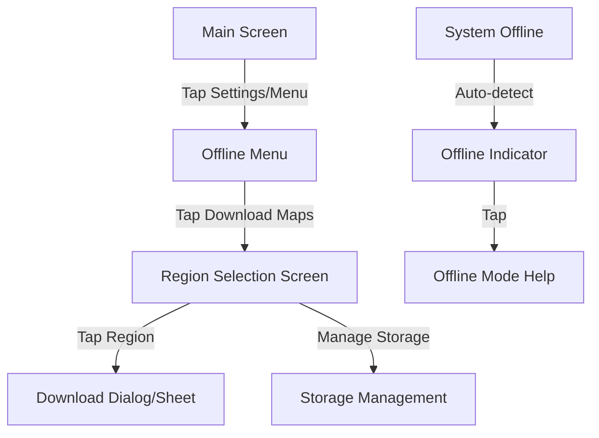

# Offline Maps UX Specification

**Version:** 1.0.0
**Date:** 2025-12-10
**Author:** UI/UX Designer
**Status:** Approved for Implementation

---

## 1. Executive Summary

This specification defines the user experience for the "Offline Maps" feature of the PH Fare Calculator. The goal is to empower commuters to navigate and calculate fares even with spotty or non-existent internet connectivity. The design leverages the established "Jeepney" design system (Deep Blue, Sun Yellow) while adhering to Material 3 principles for a modern, accessible Flutter application.

The core feature set includes managing downloadable map regions, visualizing storage usage, and clearly indicating connectivity status to prevent user frustration.

---

## 2. User Flows & Navigation

### 2.1. Entry Points

**Primary Entry: Settings / Offline Menu**
*   **Location:** `OfflineMenuScreen` (repurposed) or a new section in `SettingsScreen`.
*   **UI Component:** A prominent card titled "Offline Maps" with a subtitle "Download areas for use without internet".
*   **Visual Cue:** Icon `download_for_offline` (Material Symbols).

**Contextual Entry: Map Picker**
*   **Scenario:** When a user opens the map picker and connectivity is detected as "Limited" or "Offline".
*   **UI Component:** A `Snackbar` or non-blocking Banner: "Offline? Download this region to view map details." -> Action: "Go to Downloads".

### 2.2. Navigation Map


---

## 3. Screen Specifications

### 3.1. Region Selection Screen (`RegionDownloadScreen`)

**Objective:** Allow users to browse, download, and manage map regions.

**Layout:**
*   **AppBar:** Title "Offline Maps", Action "Help".
*   **Header:** Storage usage summary bar (Visual progress bar showing Used vs. Free space).
*   **Body:** List of `DownloadableRegionCard` items.

**Components:**

#### A. Storage Summary Header
*   **Visual:** A linear progress indicator.
    *   **Segment 1 (App Data):** Primary Color (Blue).
    *   **Segment 2 (Map Data):** Secondary Color (Yellow).
    *   **Segment 3 (Free Space):** Grey Track.
*   **Text:** "Used: 150MB • Free: 2.4GB on device".

#### B. Region List Item (`DownloadableRegionCard`)
*   **State: Not Downloaded**
    *   **Left:** Mini-map thumbnail of the region (static asset).
    *   **Center:**
        *   **Title:** Region Name (e.g., "Metro Manila").
        *   **Subtitle:** "Est. 150 MB".
    *   **Right:** `IconButton` (Download).
*   **State: Downloading**
    *   **Center:** "Downloading... 45%"
    *   **Bottom:** Linear Progress Indicator.
    *   **Right:** `IconButton` (Pause/Cancel).
*   **State: Downloaded**
    *   **Right:** Green Checkmark Icon + Menu Button (Three dots).
    *   **Menu Options:** "Check for Updates", "Delete".

### 3.2. Download Experience

**Feedback Mechanisms:**
*   **Initiation:** Button turns into a circular spinner -> then linear progress bar.
*   **Progress:** Smooth animation of the progress bar. Text updates "12MB / 150MB".
*   **Background:** If user leaves screen, show a global notification or a small pill indicator in the main app bar "Downloading Maps...".
*   **Completion:** Haptic feedback (vibration), Toast message "Metro Manila map ready for offline use".

**Error Handling:**
*   **Network Failure:** "Download paused. Waiting for connection..." (Amber state).
*   **Storage Full:** Alert Dialog: "Not enough space. Free up [X] MB to continue."

### 3.3. Storage Management

**Delete Flow:**
1.  User taps "Delete" on a region.
2.  **Confirmation Dialog:**
    *   Title: "Delete Metro Manila?"
    *   Body: "You will need internet to view this map area again."
    *   Actions: [Cancel] [Delete (Red)].

### 3.4. Offline Mode Indicators

**Global Indicator:**
*   **Location:** Top of `MainScreen` (below AppBar, above content).
*   **Component:** `OfflineIndicatorWidget`.
*   **Visual:**
    *   **Background:** Grey-900 (Dark) or Grey-200 (Light).
    *   **Icon:** `cloud_off`.
    *   **Text:** "You are offline. Showing cached routes."
    *   **Animation:** Slide down when connection lost, slide up when restored.

**Map Interaction:**
*   **Missing Tiles:** If user pans to an area NOT downloaded:
    *   Show grid pattern placeholder.
    *   Overlay Text: "Map data not available offline."

---

## 4. UI Components & Tokens (Theme Spec Alignment)

### 4.1. Colors
*   **Download/Action:** `Primary` (Deep Blue `#0038A8`).
*   **Success/Downloaded:** `Success` (Green `#4CAF50` - *New Token needed in Theme*).
*   **Warning/Offline:** `Amber` / `Secondary` (Sun Yellow `#FCD116`) for visibility.
*   **Error/Delete:** `Tertiary` (Flag Red `#CE1126`).

### 4.2. Typography
*   **Region Title:** `Title Medium` (Poppins, 16sp, w600).
*   **Metadata:** `Body Small` (Inter, 12sp, Grey).
*   **Progress Text:** `Label Small` (Inter, 11sp, Mono-spaced numbers preferred).

### 4.3. Ascii Wireframe: Region Card

```text
+-------------------------------------------------------+
| [ Map  ]  Metro Manila                                |
| [Thumb ]  150 MB • Last updated 2 days ago            |
| [ nail ]                                     [ DOWN ] | <--(Icon Button)
+-------------------------------------------------------+

+-------------------------------------------------------+
| [ Map  ]  Cebu City                                   |
| [Thumb ]  Downloading... 45%                 [ || ]   | <--(Pause/Cancel)
| [ nail ]  [=============-------]                      |
+-------------------------------------------------------+
```

---

## 5. First-Time User Flow (Onboarding)

### 5.1. New Installation
*   **Step:** After initial "Welcome" slides.
*   **Prompt:** "Download Offline Maps?"
*   **Context:** "Save data and navigate faster by downloading your local region now."
*   **Selection:** Auto-detect closest region (if location permission granted) or show list.
*   **Action:** [Download Now] [Skip].

### 5.2. Existing User
*   **Trigger:** First launch after update.
*   **Feature Discovery:** Blue dot on the "Settings" or "Offline Menu" tab.

---

## 6. Accessibility (a11y)

*   **Screen Readers:**
    *   Download buttons must have labels: "Download Metro Manila map, 150 megabytes".
    *   Progress bars must announce updates (e.g., every 10% or on focus).
*   **Contrast:** Ensure yellow text on white background is avoided. Use Dark Grey (`#1A1C1E`) on Yellow backgrounds.
*   **Touch Targets:** All icon buttons must be at least 48x48dp.

---

## 7. Deliverables Checklist

*   [ ] `RegionDownloadScreen` (Flutter Widget)
*   [ ] `DownloadableRegionCard` (Component)
*   [ ] `OfflineIndicator` (Component)
*   [ ] `StorageProgressBar` (Component)