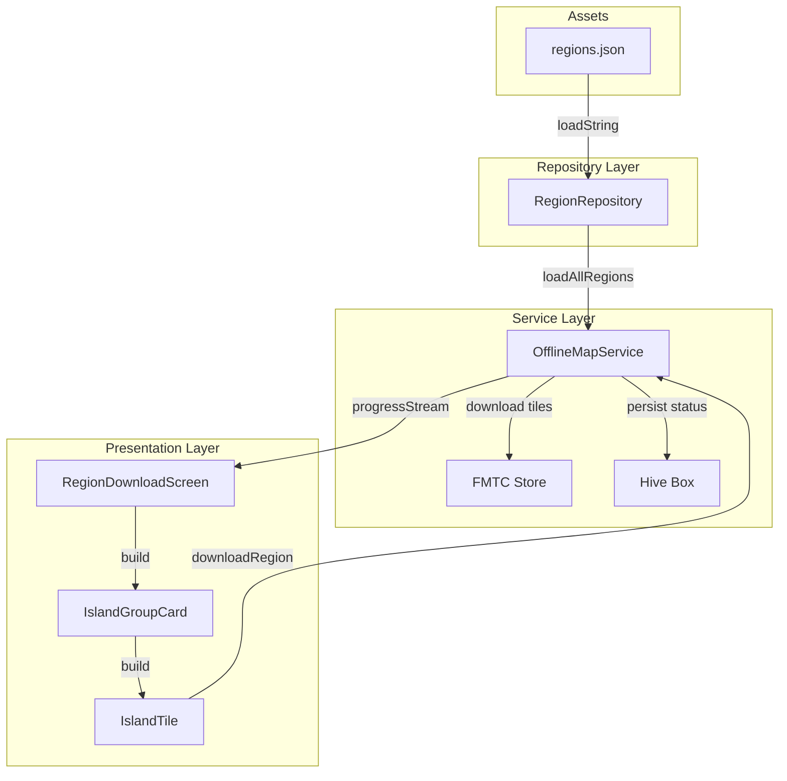
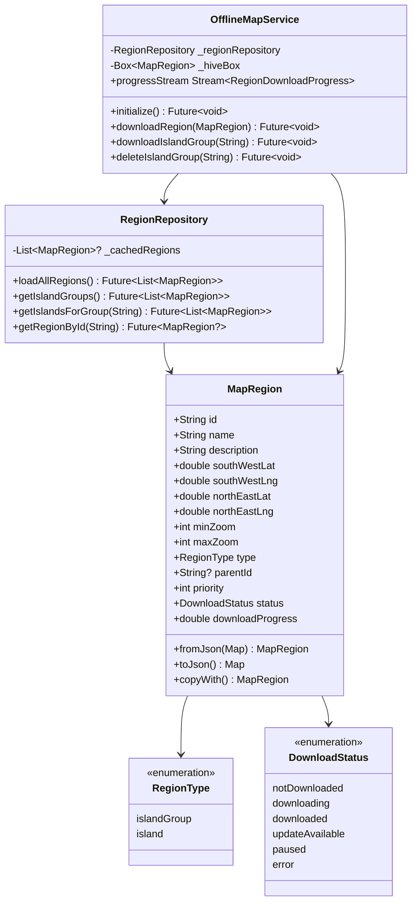
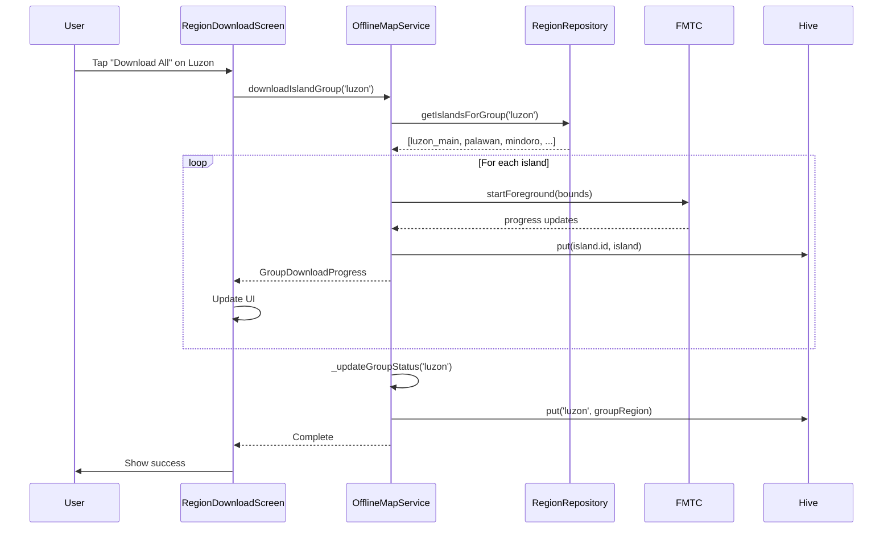

# Modular Offline Maps Architecture

## Executive Summary

This document defines the complete architecture for transitioning the PH Fare Calculator's offline map system from a hardcoded 3-region model to a flexible, hierarchical island-based download system. The new architecture enables users to download entire island groups (Luzon, Visayas, Mindanao) or individual major islands, significantly reducing storage requirements and improving user experience.

**Key Changes:**
- Replace hardcoded `PredefinedRegions` class with JSON-driven configuration
- Add parent-child relationships to `MapRegion` model via new `RegionType` enum and `parentId` field
- Update `OfflineMapService` to load regions dynamically and handle hierarchical downloads
- Redesign `RegionDownloadScreen` with expandable sections for island groups

**Backward Compatibility:** Maintained through optional fields and Hive migration strategy.

---

## Table of Contents

1. [Hierarchical JSON Schema](#1-hierarchical-json-schema)
2. [Updated MapRegion Model](#2-updated-mapregion-model)
3. [Service Layer Changes](#3-service-layer-changes)
4. [UI/UX Recommendations](#4-uiux-recommendations)
5. [Migration Strategy](#5-migration-strategy)
6. [Architecture Diagrams](#6-architecture-diagrams)

---

## 1. Hierarchical JSON Schema

### 1.1 Schema Design Philosophy

The JSON schema uses a **flat array with parent references** rather than nested objects. This approach:
- Simplifies parsing and querying
- Allows easy filtering by `type` or `parentId`
- Maintains compatibility with existing `MapRegion.fromJson()` pattern
- Enables future addition of sub-islands without schema changes

### 1.2 Schema Definition

```json
{
  "$schema": "http://json-schema.org/draft-07/schema#",
  "title": "Philippine Regions Schema",
  "type": "array",
  "items": {
    "type": "object",
    "required": ["id", "name", "type", "bounds", "minZoom", "maxZoom"],
    "properties": {
      "id": {
        "type": "string",
        "description": "Unique identifier (snake_case)",
        "pattern": "^[a-z][a-z0-9_]*$"
      },
      "name": {
        "type": "string",
        "description": "Display name for the region"
      },
      "description": {
        "type": "string",
        "description": "Brief description of the region"
      },
      "type": {
        "type": "string",
        "enum": ["island_group", "island"],
        "description": "Region type: island_group for parent, island for child"
      },
      "parentId": {
        "type": ["string", "null"],
        "description": "ID of parent island_group (null for island_groups)"
      },
      "bounds": {
        "type": "object",
        "required": ["southWestLat", "southWestLng", "northEastLat", "northEastLng"],
        "properties": {
          "southWestLat": { "type": "number" },
          "southWestLng": { "type": "number" },
          "northEastLat": { "type": "number" },
          "northEastLng": { "type": "number" }
        }
      },
      "minZoom": {
        "type": "integer",
        "minimum": 1,
        "maximum": 18,
        "default": 8
      },
      "maxZoom": {
        "type": "integer",
        "minimum": 1,
        "maximum": 18,
        "default": 14
      },
      "estimatedSizeMB": {
        "type": "integer",
        "description": "Estimated download size in megabytes"
      },
      "estimatedTileCount": {
        "type": "integer",
        "description": "Estimated number of tiles to download"
      },
      "priority": {
        "type": "integer",
        "description": "Display order within parent (lower = first)",
        "default": 100
      }
    }
  }
}
```

### 1.3 Example Structure

```json
[
  {
    "id": "luzon",
    "name": "Luzon",
    "description": "Luzon island group - largest island group in the Philippines",
    "type": "island_group",
    "parentId": null,
    "bounds": {
      "southWestLat": 8.30,
      "southWestLng": 116.90,
      "northEastLat": 21.20,
      "northEastLng": 124.60
    },
    "minZoom": 8,
    "maxZoom": 14,
    "estimatedSizeMB": 1200,
    "estimatedTileCount": 120000,
    "priority": 1
  },
  {
    "id": "luzon_main",
    "name": "Luzon Main Island",
    "description": "Main island of Luzon including Metro Manila, Central Luzon, and Bicol",
    "type": "island",
    "parentId": "luzon",
    "bounds": {
      "southWestLat": 12.50,
      "southWestLng": 119.50,
      "northEastLat": 18.70,
      "northEastLng": 124.50
    },
    "minZoom": 8,
    "maxZoom": 14,
    "estimatedSizeMB": 450,
    "estimatedTileCount": 45000,
    "priority": 1
  }
]
```

### 1.4 Complete Island List

The JSON file at `assets/data/regions.json` will contain all 28 regions:

**Island Groups (3):**
| ID | Name | Priority |
|----|------|----------|
| luzon | Luzon | 1 |
| visayas | Visayas | 2 |
| mindanao | Mindanao | 3 |

**Luzon Islands (10):**
| ID | Name | SW Lat | SW Lng | NE Lat | NE Lng |
|----|------|--------|--------|--------|--------|
| luzon_main | Luzon Main Island | 12.50 | 119.50 | 18.70 | 124.50 |
| mindoro | Mindoro | 12.10 | 120.20 | 13.60 | 121.60 |
| palawan | Palawan | 8.30 | 116.90 | 12.50 | 120.40 |
| catanduanes | Catanduanes | 13.50 | 124.00 | 14.10 | 124.50 |
| marinduque | Marinduque | 13.15 | 121.80 | 13.60 | 122.20 |
| masbate | Masbate | 11.70 | 122.90 | 13.15 | 124.10 |
| romblon | Romblon Group | 11.70 | 121.80 | 12.70 | 122.70 |
| batanes | Batanes | 20.20 | 121.70 | 21.20 | 122.10 |
| polillo | Polillo Islands | 14.60 | 121.80 | 15.20 | 122.20 |
| lubang | Lubang Islands | 13.60 | 120.00 | 13.90 | 120.25 |

**Visayas Islands (11):**
| ID | Name | SW Lat | SW Lng | NE Lat | NE Lng |
|----|------|--------|--------|--------|--------|
| panay | Panay | 10.40 | 121.80 | 12.10 | 123.20 |
| negros | Negros | 9.00 | 122.30 | 11.10 | 123.60 |
| cebu | Cebu | 9.40 | 123.20 | 11.40 | 124.10 |
| bohol | Bohol | 9.50 | 123.70 | 10.20 | 124.70 |
| leyte | Leyte | 9.90 | 124.20 | 11.60 | 125.30 |
| samar | Samar | 10.90 | 124.10 | 12.70 | 126.10 |
| siquijor | Siquijor | 9.10 | 123.40 | 9.35 | 123.70 |
| guimaras | Guimaras | 10.40 | 122.50 | 10.75 | 122.80 |
| biliran | Biliran | 11.40 | 124.30 | 11.80 | 124.60 |
| bantayan | Bantayan | 11.10 | 123.60 | 11.35 | 123.85 |
| camotes | Camotes Group | 10.50 | 124.20 | 10.80 | 124.50 |

**Mindanao Islands (7):**
| ID | Name | SW Lat | SW Lng | NE Lat | NE Lng |
|----|------|--------|--------|--------|--------|
| mindanao_main | Mindanao Main Island | 5.30 | 121.80 | 10.00 | 126.70 |
| basilan | Basilan | 6.25 | 121.70 | 6.75 | 122.40 |
| sulu | Sulu Archipelago | 4.50 | 119.30 | 6.50 | 121.50 |
| camiguin | Camiguin | 9.10 | 124.60 | 9.30 | 124.85 |
| siargao | Siargao | 9.60 | 125.90 | 10.10 | 126.20 |
| dinagat | Dinagat Islands | 9.80 | 125.40 | 10.50 | 125.70 |
| samal | Samal Island | 6.90 | 125.60 | 7.20 | 125.85 |

---

## 2. Updated MapRegion Model

### 2.1 New RegionType Enum

```dart
/// Type of map region for hierarchical organization.
@HiveType(typeId: 12)
enum RegionType {
  /// A parent region containing multiple islands (e.g., Luzon, Visayas, Mindanao).
  @HiveField(0)
  islandGroup,

  /// An individual island within a parent group.
  @HiveField(1)
  island,
}

/// Extension methods for [RegionType].
extension RegionTypeX on RegionType {
  /// Returns true if this is a parent region that can contain children.
  bool get isParent => this == RegionType.islandGroup;

  /// Returns true if this is a child island.
  bool get isChild => this == RegionType.island;

  /// Returns a human-readable label.
  String get label {
    switch (this) {
      case RegionType.islandGroup:
        return 'Island Group';
      case RegionType.island:
        return 'Island';
    }
  }
}
```

### 2.2 Updated MapRegion Class

```dart
import 'package:hive/hive.dart';
import 'package:latlong2/latlong.dart';

part 'map_region.g.dart';

/// Status of a map region download.
@HiveType(typeId: 10)
enum DownloadStatus {
  @HiveField(0)
  notDownloaded,
  @HiveField(1)
  downloading,
  @HiveField(2)
  downloaded,
  @HiveField(3)
  updateAvailable,
  @HiveField(4)
  paused,
  @HiveField(5)
  error,
}

/// Type of map region for hierarchical organization.
@HiveType(typeId: 12)
enum RegionType {
  @HiveField(0)
  islandGroup,
  @HiveField(1)
  island,
}

/// Represents a downloadable map region with optional hierarchical relationships.
///
/// Supports both island groups (parent regions) and individual islands (child regions).
/// Parent regions can be downloaded as a whole, which downloads all child islands.
@HiveType(typeId: 11)
class MapRegion extends HiveObject {
  /// Unique identifier for the region.
  @HiveField(0)
  final String id;

  /// Display name of the region.
  @HiveField(1)
  final String name;

  /// Description of the region.
  @HiveField(2)
  final String description;

  /// Southwest latitude of the bounds.
  @HiveField(3)
  final double southWestLat;

  /// Southwest longitude of the bounds.
  @HiveField(4)
  final double southWestLng;

  /// Northeast latitude of the bounds.
  @HiveField(5)
  final double northEastLat;

  /// Northeast longitude of the bounds.
  @HiveField(6)
  final double northEastLng;

  /// Minimum zoom level to download.
  @HiveField(7)
  final int minZoom;

  /// Maximum zoom level to download.
  @HiveField(8)
  final int maxZoom;

  /// Estimated tile count for the region.
  @HiveField(9)
  final int estimatedTileCount;

  /// Estimated size in megabytes.
  @HiveField(10)
  final int estimatedSizeMB;

  /// Current download status.
  @HiveField(11)
  DownloadStatus status;

  /// Download progress (0.0 to 1.0).
  @HiveField(12)
  double downloadProgress;

  /// Number of tiles downloaded.
  @HiveField(13)
  int tilesDownloaded;

  /// Actual size on disk in bytes (after download).
  @HiveField(14)
  int? actualSizeBytes;

  /// Timestamp when the region was last updated.
  @HiveField(15)
  DateTime? lastUpdated;

  /// Error message if download failed.
  @HiveField(16)
  String? errorMessage;

  // ========== NEW FIELDS FOR HIERARCHICAL SUPPORT ==========

  /// Type of region: islandGroup (parent) or island (child).
  /// Defaults to island for backward compatibility with existing data.
  @HiveField(17)
  final RegionType type;

  /// ID of the parent island group (null for island_group types).
  /// Used to establish parent-child relationships.
  @HiveField(18)
  final String? parentId;

  /// Display priority within parent (lower = displayed first).
  @HiveField(19)
  final int priority;

  MapRegion({
    required this.id,
    required this.name,
    required this.description,
    required this.southWestLat,
    required this.southWestLng,
    required this.northEastLat,
    required this.northEastLng,
    this.minZoom = 8,
    this.maxZoom = 14,
    required this.estimatedTileCount,
    required this.estimatedSizeMB,
    this.status = DownloadStatus.notDownloaded,
    this.downloadProgress = 0.0,
    this.tilesDownloaded = 0,
    this.actualSizeBytes,
    this.lastUpdated,
    this.errorMessage,
    // New fields with defaults for backward compatibility
    this.type = RegionType.island,
    this.parentId,
    this.priority = 100,
  });

  /// Gets the southwest corner of the bounds.
  LatLng get southWest => LatLng(southWestLat, southWestLng);

  /// Gets the northeast corner of the bounds.
  LatLng get northEast => LatLng(northEastLat, northEastLng);

  /// Gets the center of the region.
  LatLng get center => LatLng(
        (southWestLat + northEastLat) / 2,
        (southWestLng + northEastLng) / 2,
      );

  /// Returns true if this is a parent island group.
  bool get isParent => type == RegionType.islandGroup;

  /// Returns true if this is a child island.
  bool get isChild => type == RegionType.island;

  /// Returns true if this region has a parent.
  bool get hasParent => parentId != null;

  /// Creates a MapRegion from JSON map.
  factory MapRegion.fromJson(Map<String, dynamic> json) {
    final bounds = json['bounds'] as Map<String, dynamic>;
    final typeStr = json['type'] as String? ?? 'island';
    
    return MapRegion(
      id: json['id'] as String,
      name: json['name'] as String,
      description: json['description'] as String? ?? '',
      southWestLat: (bounds['southWestLat'] as num).toDouble(),
      southWestLng: (bounds['southWestLng'] as num).toDouble(),
      northEastLat: (bounds['northEastLat'] as num).toDouble(),
      northEastLng: (bounds['northEastLng'] as num).toDouble(),
      minZoom: json['minZoom'] as int? ?? 8,
      maxZoom: json['maxZoom'] as int? ?? 14,
      estimatedTileCount: json['estimatedTileCount'] as int? ?? 0,
      estimatedSizeMB: json['estimatedSizeMB'] as int? ?? 0,
      type: typeStr == 'island_group' ? RegionType.islandGroup : RegionType.island,
      parentId: json['parentId'] as String?,
      priority: json['priority'] as int? ?? 100,
    );
  }

  /// Converts this MapRegion to a JSON map.
  Map<String, dynamic> toJson() {
    return {
      'id': id,
      'name': name,
      'description': description,
      'bounds': {
        'southWestLat': southWestLat,
        'southWestLng': southWestLng,
        'northEastLat': northEastLat,
        'northEastLng': northEastLng,
      },
      'minZoom': minZoom,
      'maxZoom': maxZoom,
      'estimatedTileCount': estimatedTileCount,
      'estimatedSizeMB': estimatedSizeMB,
      'type': type == RegionType.islandGroup ? 'island_group' : 'island',
      'parentId': parentId,
      'priority': priority,
    };
  }

  /// Creates a copy with updated fields.
  MapRegion copyWith({
    String? id,
    String? name,
    String? description,
    double? southWestLat,
    double? southWestLng,
    double? northEastLat,
    double? northEastLng,
    int? minZoom,
    int? maxZoom,
    int? estimatedTileCount,
    int? estimatedSizeMB,
    DownloadStatus? status,
    double? downloadProgress,
    int? tilesDownloaded,
    int? actualSizeBytes,
    DateTime? lastUpdated,
    String? errorMessage,
    RegionType? type,
    String? parentId,
    int? priority,
  }) {
    return MapRegion(
      id: id ?? this.id,
      name: name ?? this.name,
      description: description ?? this.description,
      southWestLat: southWestLat ?? this.southWestLat,
      southWestLng: southWestLng ?? this.southWestLng,
      northEastLat: northEastLat ?? this.northEastLat,
      northEastLng: northEastLng ?? this.northEastLng,
      minZoom: minZoom ?? this.minZoom,
      maxZoom: maxZoom ?? this.maxZoom,
      estimatedTileCount: estimatedTileCount ?? this.estimatedTileCount,
      estimatedSizeMB: estimatedSizeMB ?? this.estimatedSizeMB,
      status: status ?? this.status,
      downloadProgress: downloadProgress ?? this.downloadProgress,
      tilesDownloaded: tilesDownloaded ?? this.tilesDownloaded,
      actualSizeBytes: actualSizeBytes ?? this.actualSizeBytes,
      lastUpdated: lastUpdated ?? this.lastUpdated,
      errorMessage: errorMessage ?? this.errorMessage,
      type: type ?? this.type,
      parentId: parentId ?? this.parentId,
      priority: priority ?? this.priority,
    );
  }

  @override
  String toString() {
    return 'MapRegion(id: $id, name: $name, type: ${type.label}, status: ${status.label})';
  }
}
```

### 2.3 RegionRepository Class (New)

```dart
import 'dart:convert';
import 'package:flutter/services.dart' show rootBundle;

/// Repository for loading and managing map regions from JSON.
class RegionRepository {
  static const String _jsonPath = 'assets/data/regions.json';
  
  List<MapRegion>? _cachedRegions;

  /// Loads all regions from the JSON asset file.
  Future<List<MapRegion>> loadAllRegions() async {
    if (_cachedRegions != null) {
      return _cachedRegions!;
    }

    final jsonString = await rootBundle.loadString(_jsonPath);
    final List<dynamic> jsonList = json.decode(jsonString) as List<dynamic>;
    
    _cachedRegions = jsonList
        .map((json) => MapRegion.fromJson(json as Map<String, dynamic>))
        .toList();
    
    return _cachedRegions!;
  }

  /// Gets all island groups (parent regions).
  Future<List<MapRegion>> getIslandGroups() async {
    final regions = await loadAllRegions();
    return regions
        .where((r) => r.type == RegionType.islandGroup)
        .toList()
      ..sort((a, b) => a.priority.compareTo(b.priority));
  }

  /// Gets all islands (child regions) for a given parent ID.
  Future<List<MapRegion>> getIslandsForGroup(String parentId) async {
    final regions = await loadAllRegions();
    return regions
        .where((r) => r.parentId == parentId)
        .toList()
      ..sort((a, b) => a.priority.compareTo(b.priority));
  }

  /// Gets a region by ID.
  Future<MapRegion?> getRegionById(String id) async {
    final regions = await loadAllRegions();
    try {
      return regions.firstWhere((r) => r.id == id);
    } catch (_) {
      return null;
    }
  }

  /// Gets all child regions for a parent, recursively if needed.
  Future<List<MapRegion>> getAllChildRegions(String parentId) async {
    return getIslandsForGroup(parentId);
  }

  /// Clears the cache (useful for testing or hot reload).
  void clearCache() {
    _cachedRegions = null;
  }
}
```

### 2.4 Backward Compatibility Notes

The updated `MapRegion` class maintains full backward compatibility:

1. **New HiveFields (17, 18, 19)** - Hive will return `null` for these fields in existing data, and the constructor provides defaults.
2. **RegionType enum (typeId: 12)** - New Hive type, no conflict with existing types.
3. **Existing code** - Any code using `PredefinedRegions.all` will continue to work until migrated.

---

## 3. Service Layer Changes

### 3.1 OfflineMapService Updates

The `OfflineMapService` requires the following modifications:

#### 3.1.1 Dependency Injection

```dart
class OfflineMapService {
  final RegionRepository _regionRepository;
  
  // ... existing fields ...
  
  OfflineMapService({
    RegionRepository? regionRepository,
  }) : _regionRepository = regionRepository ?? RegionRepository();
}
```

#### 3.1.2 Initialization Changes

**Current (Remove):**
```dart
// OLD: Hardcoded regions
for (final region in PredefinedRegions.all) {
  // restore from Hive
}
```

**New Implementation:**
```dart
/// Initializes the service and loads regions from JSON.
Future<void> initialize() async {
  await _initFMTC();
  await _openHiveBox();
  await _loadRegionsFromJson();
  await _restoreRegionStates();
}

/// Loads regions from JSON and caches them.
Future<void> _loadRegionsFromJson() async {
  _allRegions = await _regionRepository.loadAllRegions();
}

/// Restores download states from Hive for all regions.
Future<void> _restoreRegionStates() async {
  for (final region in _allRegions) {
    final savedRegion = _hiveBox.get(region.id);
    if (savedRegion != null) {
      region.status = savedRegion.status;
      region.downloadProgress = savedRegion.downloadProgress;
      region.tilesDownloaded = savedRegion.tilesDownloaded;
      region.actualSizeBytes = savedRegion.actualSizeBytes;
      region.lastUpdated = savedRegion.lastUpdated;
      region.errorMessage = savedRegion.errorMessage;
    }
  }
}
```

#### 3.1.3 Hierarchical Download Methods

```dart
/// Downloads all child islands for an island group.
/// 
/// Emits progress for each child region and aggregates total progress.
Future<void> downloadIslandGroup(String groupId) async {
  final children = await _regionRepository.getIslandsForGroup(groupId);
  
  if (children.isEmpty) {
    throw ArgumentError('No islands found for group: $groupId');
  }

  int totalTiles = children.fold(0, (sum, r) => sum + r.estimatedTileCount);
  int downloadedTiles = 0;

  for (final child in children) {
    if (child.status == DownloadStatus.downloaded) {
      downloadedTiles += child.tilesDownloaded;
      continue;
    }

    await downloadRegion(
      child,
      onProgress: (progress) {
        // Emit aggregated progress for the group
        final groupProgress = RegionDownloadProgress(
          region: _getRegionById(groupId)!,
          tilesDownloaded: downloadedTiles + progress.tilesDownloaded,
          totalTiles: totalTiles,
        );
        _progressController.add(groupProgress);
      },
    );
    
    downloadedTiles += child.tilesDownloaded;
  }

  // Update parent group status
  await _updateGroupStatus(groupId);
}

/// Updates the parent group's status based on children.
Future<void> _updateGroupStatus(String groupId) async {
  final group = _getRegionById(groupId);
  if (group == null) return;

  final children = await _regionRepository.getIslandsForGroup(groupId);
  
  final allDownloaded = children.every(
    (c) => c.status == DownloadStatus.downloaded
  );
  final anyDownloading = children.any(
    (c) => c.status == DownloadStatus.downloading
  );
  final anyError = children.any(
    (c) => c.status == DownloadStatus.error
  );

  if (allDownloaded) {
    group.status = DownloadStatus.downloaded;
    group.downloadProgress = 1.0;
  } else if (anyDownloading) {
    group.status = DownloadStatus.downloading;
  } else if (anyError) {
    group.status = DownloadStatus.error;
  } else {
    group.status = DownloadStatus.notDownloaded;
  }

  await _hiveBox.put(group.id, group);
}
```

#### 3.1.4 Hive Key Strategy

The Hive box uses the region `id` as the key, which works seamlessly with the new hierarchical structure:

```dart
// Hive keys are the region IDs
// Parent groups: 'luzon', 'visayas', 'mindanao'
// Child islands: 'luzon_main', 'palawan', 'cebu', etc.

await _hiveBox.put(region.id, region);
final savedRegion = _hiveBox.get(region.id);
```

#### 3.1.5 Progress Tracking for Hierarchical Downloads

```dart
/// Progress stream that supports both individual and group downloads.
Stream<RegionDownloadProgress> get progressStream => _progressController.stream;

/// Extended progress class for group downloads.
class GroupDownloadProgress extends RegionDownloadProgress {
  /// Child regions being downloaded.
  final List<MapRegion> children;
  
  /// Current child being downloaded.
  final MapRegion? currentChild;
  
  /// Index of current child (0-based).
  final int currentChildIndex;

  const GroupDownloadProgress({
    required super.region,
    required super.tilesDownloaded,
    required super.totalTiles,
    required this.children,
    this.currentChild,
    this.currentChildIndex = 0,
  });

  /// Progress message for UI.
  String get progressMessage {
    if (currentChild != null) {
      return 'Downloading ${currentChild!.name} (${currentChildIndex + 1}/${children.length})';
    }
    return 'Downloading ${region.name}';
  }
}
```

### 3.2 New Methods Summary

| Method | Description |
|--------|-------------|
| `loadRegionsFromJson()` | Load all regions from JSON asset |
| `getIslandGroups()` | Get all parent island groups |
| `getIslandsForGroup(parentId)` | Get child islands for a group |
| `downloadIslandGroup(groupId)` | Download all islands in a group |
| `deleteIslandGroup(groupId)` | Delete all islands in a group |
| `getGroupDownloadStatus(groupId)` | Get aggregated status for a group |
| `getGroupDownloadProgress(groupId)` | Get aggregated progress for a group |

---

## 4. UI/UX Recommendations

### 4.1 RegionDownloadScreen Redesign

#### 4.1.1 Layout Structure

```
┌─────────────────────────────────────────────────┐
│  ← Offline Maps                          [⚙️]  │
├─────────────────────────────────────────────────┤
│                                                 │
│  Storage: 1.2 GB used / 8.5 GB free            │
│  ━━━━━━━━━━━━━━━━░░░░░░░░░░░░░░░░░░░░░░░░░     │
│                                                 │
├─────────────────────────────────────────────────┤
│                                                 │
│  ▼ LUZON                           [Download]  │
│  ├─────────────────────────────────────────────│
│  │  ☐ Luzon Main Island              ~450 MB  │
│  │  ☐ Palawan                        ~120 MB  │
│  │  ☐ Mindoro                         ~80 MB  │
│  │  ☐ Catanduanes                     ~25 MB  │
│  │  ... (7 more)                              │
│  └─────────────────────────────────────────────│
│                                                 │
│  ▶ VISAYAS                         [Download]  │
│     (11 islands, ~480 MB total)                │
│                                                 │
│  ▶ MINDANAO                        [Download]  │
│     (7 islands, ~550 MB total)                 │
│                                                 │
└─────────────────────────────────────────────────┘
```

#### 4.1.2 Component Hierarchy

```dart
// Widget tree structure
RegionDownloadScreen
├── StorageInfoHeader
├── ListView
│   ├── IslandGroupCard (Luzon)
│   │   ├── GroupHeader (collapsible)
│   │   │   ├── Icon (expand/collapse)
│   │   │   ├── Group Name
│   │   │   ├── Status Badge
│   │   │   └── Download All Button
│   │   └── IslandList (when expanded)
│   │       ├── IslandTile (Luzon Main)
│   │       ├── IslandTile (Palawan)
│   │       └── ...
│   ├── IslandGroupCard (Visayas)
│   └── IslandGroupCard (Mindanao)
└── BottomActionBar (optional: "Download All Regions")
```

#### 4.1.3 UI States

**Island Group States:**
| State | Icon | Background | Action Button |
|-------|------|------------|---------------|
| Not Downloaded | ▶ | Default | "Download All" |
| Partially Downloaded | ▶ | Light blue | "Complete Download" |
| All Downloaded | ▶ | Green tint | "Delete All" |
| Downloading | ▶ | Animated | "Cancel" |
| Error | ▶ | Red tint | "Retry" |

**Individual Island States:**
| State | Icon | Action |
|-------|------|--------|
| Not Downloaded | ☐ | "Download" |
| Downloaded | ☑ | "Delete" |
| Downloading | ⟳ (spinning) | "Cancel" |
| Error | ⚠ | "Retry" |

#### 4.1.4 Interaction Patterns

1. **Tap Group Header** → Expand/collapse island list
2. **Tap "Download All" on Group** → Queue all child islands for download
3. **Tap individual island checkbox** → Download/delete that island
4. **Long-press island** → Show context menu (Delete, View on Map)
5. **Swipe island left** → Quick delete action

#### 4.1.5 Progress Display

```dart
// During group download, show:
// 1. Overall group progress bar
// 2. Current island being downloaded
// 3. Tiles downloaded / total tiles
// 4. Estimated time remaining

Widget _buildGroupProgress(GroupDownloadProgress progress) {
  return Column(
    children: [
      LinearProgressIndicator(value: progress.progress),
      Text(progress.progressMessage), // "Downloading Palawan (3/10)"
      Text('${progress.tilesDownloaded}/${progress.totalTiles} tiles'),
    ],
  );
}
```

### 4.2 Accessibility Considerations

1. **Screen Reader** - Each island group and island should have descriptive labels
2. **Large Touch Targets** - Minimum 48x48 dp for all interactive elements
3. **Color Contrast** - Status colors must meet WCAG AA standards
4. **Haptic Feedback** - Vibrate on download complete/error

### 4.3 Offline-First Design

1. **Pre-cache JSON** - Load `regions.json` at app startup
2. **Optimistic UI** - Update UI immediately, sync Hive async
3. **Background Downloads** - Support download queue with WorkManager
4. **Resume Support** - Track partial downloads for resume

---

## 5. Migration Strategy

### 5.1 Hive Migration

Since new HiveFields (17, 18, 19) are added with defaults, no explicit migration is needed. However, a cleanup step is recommended:

```dart
/// Migrates old region data to new format.
Future<void> migrateRegions() async {
  final box = await Hive.openBox<MapRegion>('offline_maps');
  
  // Remove old hardcoded region entries if they exist
  // These will be replaced by JSON-loaded regions
  for (final oldId in ['luzon', 'visayas', 'mindanao']) {
    final oldRegion = box.get(oldId);
    if (oldRegion != null && oldRegion.type == RegionType.island) {
      // Old format didn't have type, so it defaults to island
      // We need to check if this is the old aggregate region
      // and potentially migrate to new structure
      await box.delete(oldId);
    }
  }
}
```

### 5.2 Deprecation Plan

1. **Phase 1 (v2.0)**: Add new JSON loading alongside `PredefinedRegions`
2. **Phase 2 (v2.1)**: Mark `PredefinedRegions` as `@Deprecated`
3. **Phase 3 (v3.0)**: Remove `PredefinedRegions` class entirely

### 5.3 Feature Flag

```dart
class FeatureFlags {
  /// Use new modular island downloads instead of 3-region system.
  static const bool useModularMaps = true;
}

// In OfflineMapService.initialize():
if (FeatureFlags.useModularMaps) {
  await _loadRegionsFromJson();
} else {
  _allRegions = PredefinedRegions.all;
}
```

---

## 6. Architecture Diagrams

### 6.1 Data Flow Diagram



### 6.2 Class Diagram



### 6.3 Sequence Diagram: Download Island Group



---

## Appendix A: File Listing

| File | Purpose | Action |
|------|---------|--------|
| `assets/data/regions.json` | Hierarchical island data | **CREATE** |
| `lib/src/models/map_region.dart` | Updated data model | **MODIFY** |
| `lib/src/repositories/region_repository.dart` | JSON loading logic | **CREATE** |
| `lib/src/services/offline/offline_map_service.dart` | Service layer | **MODIFY** |
| `lib/src/presentation/screens/region_download_screen.dart` | UI | **MODIFY** |
| `lib/src/presentation/widgets/island_group_card.dart` | New widget | **CREATE** |
| `lib/src/presentation/widgets/island_tile.dart` | New widget | **CREATE** |

---

## Appendix B: Estimated Sizes Reference

The following are placeholder estimates based on typical tile sizes at zoom 8-14:

| Region | Islands | Est. Total MB |
|--------|---------|---------------|
| Luzon | 10 | ~800 |
| Visayas | 11 | ~480 |
| Mindanao | 7 | ~550 |
| **Total** | **28** | **~1,830** |

*Note: Actual sizes should be calculated using FMTC's `calculateStoreStats()` after first download, then updated in the JSON or a separate cache.*

---

**Document Version:** 1.0  
**Created:** 2025-12-11  
**Author:** Architecture Mode  
**Status:** Ready for Implementation